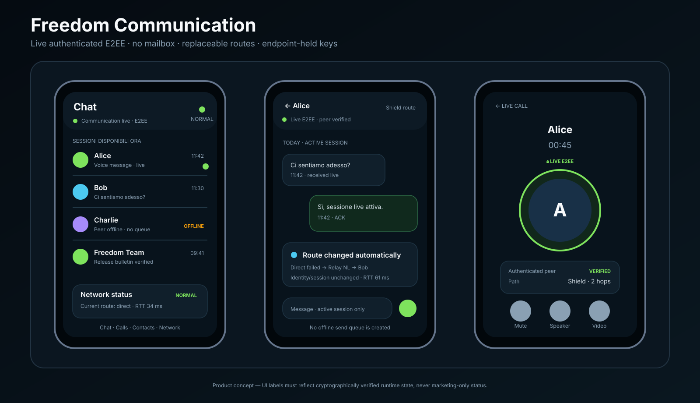
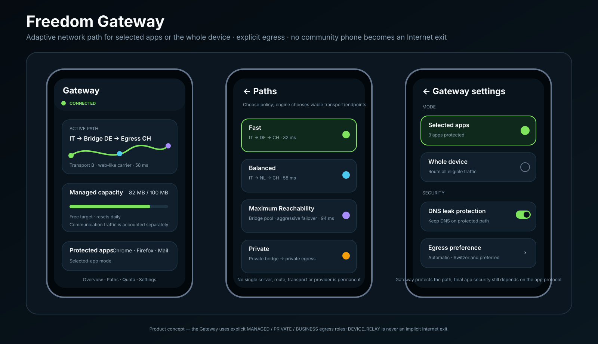
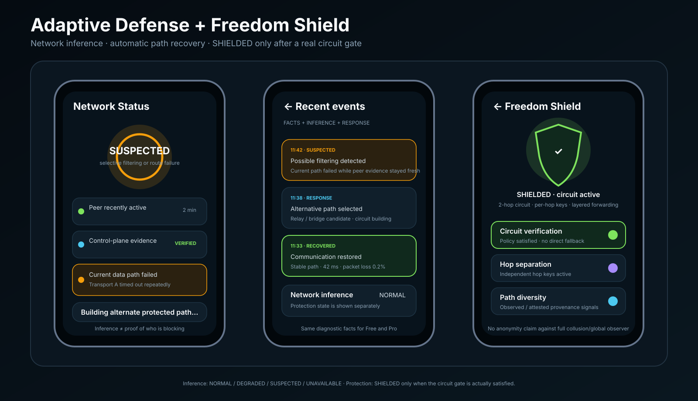
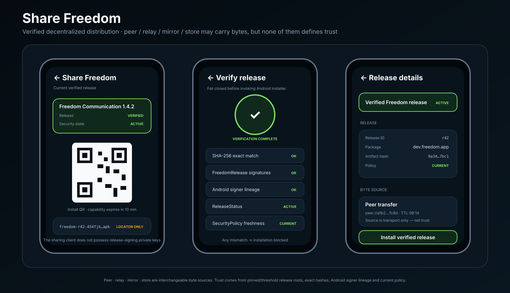

# Freedom Communication

**Powered by Freedom Protocol**

> **Nessun server centrale. Nessun super-admin. Niente di opaco. Fiducia nel protocollo. Sicurezza nell'architettura.**
>
> **Synchronous. Ephemeral. Endpoint-to-endpoint.**

Freedom Communication è un sistema di comunicazione privata live costruito su Freedom Protocol.

```text
peer raggiungibile + sessione autenticata -> comunica adesso
peer non raggiungibile                    -> fail/discard, non accodare
```

Il protocollo base non crea mailbox offline, non deposita messaggi sulla blockchain e non usa relay come storage persistente.

Le regole normative di sicurezza sono in [`docs/SECURITY_INVARIANTS.md`](docs/SECURITY_INVARIANTS.md). Gli object shape canonici sono in [`spec/freedom.cddl`](spec/freedom.cddl).

## Product family

```text
Freedom Protocol
|- Freedom Communication  -> authenticated E2EE live communication
|- Freedom Gateway        -> optional resilient network path for other apps
`- Freedom Shield         -> true multi-hop/path-protection circuit mode

Share Freedom             -> verified decentralized client distribution
```

## Freedom Communication

```text
Alice
  |
  | authenticated E2EE live session
  | forward secrecy + bounded rekey
  v
Bob
```

Target:

- expected-contact authentication;
- offline-verifiable DeviceCertificate;
- session keys at endpoints;
- forward secrecy between sessions;
- bounded traffic-key lifetime + authenticated rekey;
- no mailbox/offline queue;
- forward-only untrusted relays;
- replaceable path/transport;
- no global DeviceID in the network layer.

## Architecture


```text
RootRecoveryKey
 -> RootIdentity(root epoch)
 -> DeviceAuthorizationDelegation
 -> DeviceCertificate
 -> DeviceKey
 -> pairwise authenticated relationship
 -> route / transport selector
      |- Freedom Communication -> authenticated E2EE live session
      `- Freedom Gateway       -> explicit egress -> Internet
```

A separate `UserRecoveryPolicy` is required if the user wants cryptographic recovery from a **compromised** root key rather than only recovery from device loss.

The control-plane is consulted when needed for verified revocation/recovery/policy state; it is not the message packet hot path.

**NEAR is not Freedom Protocol.** It is the first `ChainAdapter` implementation.

### Freedom Communication architecture


### Freedom Gateway architecture


## Identity model

```text
RootRecoveryKey          -> cold continuity/recovery
UserRecoveryPolicy       -> independent compromise-recovery authority
DeviceAuthorizationKey   -> delegated device authorization
DeviceCertificate        -> offline DeviceKey authorization
DeviceKey                -> operational endpoint authentication
DeviceRecordCommitment   -> opaque control-plane handle
DeviceControlKey         -> scoped record rotation/revocation
PairwiseContactAlias     -> relationship-specific alias
PairRendezvousSecret     -> relationship rendezvous authority
TransportToken           -> temporary route/circuit token
Session keys             -> ephemeral E2EE material
```

Freedom **does not use a global `DeviceID`** as public identity or routing identifier.

A contact is a person/RootIdentity relationship, not a particular phone.

Details: [`docs/IDENTITY_MODEL.md`](docs/IDENTITY_MODEL.md).

## Device authorization and revocation

DeviceCertificate/delegation are verified offline and bound to the expected contact. Child certificate scope/expiry cannot exceed the parent delegation.

For new sessions the client additionally checks current-enough verified revocation state. An RPC `not found` response is not a proof of non-revocation.

Details: [`docs/REVOCATION.md`](docs/REVOCATION.md).

## Verified control-plane

Security-sensitive state follows:

```text
NetworkAnchor
 -> VerifiedControlPlaneCheckpoint
 -> state root
 -> inclusion/non-inclusion proof
 -> canonical object
```

A transaction hash is submission, not success:

```text
submit
 -> finality proof
 -> execution success
 -> resulting-state proof
 -> expected transition
 -> local success
```

A fresh install also enforces a `BootstrapFreshnessFloor` contained in its current verifier/release, preventing a network peer/RPC from freezing a recent verifier below that floor.

Details: [`docs/CONTROL_PLANE_SECURITY.md`](docs/CONTROL_PLANE_SECURITY.md).

## Pairwise rendezvous

After authenticated bootstrap:

```text
PairSecret
PairwiseContactAlias
PairRendezvousSecret
```

Each rendezvous direction/epoch derives a one-time write key. Public observation of a used slot does not grant overwrite authority.

Rendezvous/recovery records are encrypted, pairwise, bounded and reclaimable; TTL alone is not considered storage cleanup.

## First-contact assurance

A substituted descriptor before first bootstrap can establish a cryptographically valid relationship with the attacker. The client therefore distinguishes:

```text
BOOTSTRAP_UNVERIFIED
CONTACT_VERIFIED
```

Safety codes/fingerprints/out-of-band verification provide stronger human assurance.

## Forward secrecy and rekey

Freedom Communication requires:

```text
fresh ephemeral exchange
+ forward secrecy
+ bounded traffic-key lifetime
+ RekeyInit / RekeyCommit / RekeyAck
+ key confirmation
+ separate control/media key spaces
```

Simultaneous rekey, lost/duplicate messages and route changes have explicit state-machine behavior; rekey failure cannot silently create split-brain epochs.

## Relay

A relay can be a VPS, dedicated server, community node, managed/private node or opt-in user device.

Invariants:

- forward ciphertext, not store;
- no persistent mailbox;
- bounded buffers/TTL/concurrency;
- relay does not authenticate the peer;
- relay does not own session keys;
- `DEVICE_RELAY != INTERNET_EGRESS`;
- `N relay IDs != N independent operators`.

> **Qualsiasi macchina compatibile può inoltrare Freedom; nessuna macchina deve diventare Freedom.**

Details: [`docs/RELAYS.md`](docs/RELAYS.md).

## Freedom Shield

Freedom Shield is not simply two proxies in sequence.

A production `SHIELDED` path requires:

```text
authenticated circuit setup
+ independent per-hop keys
+ layered forwarding
+ temporary circuit identity
+ provenance-aware path selection
+ no silent direct fallback
```

Relay/operator independence is a probabilistic trust signal; self-declared metadata alone is not proof.

Details: [`docs/SHIELD.md`](docs/SHIELD.md).

## Adaptive Defense

```text
peer recently active
+ verified control-plane evidence
+ current data path failing
 -> INTERFERENCE_OR_ROUTE_FAILURE_SUSPECTED
 -> alternate path / relay / bridge / transport / Shield
```

`SUSPECTED` is an inference, not proof of censorship, surveillance or attribution.

## Freedom Gateway

```text
browser / app
 -> local Freedom Gateway tunnel
 -> route / relay / bridge / Shield
 -> explicit Egress
 -> Internet
```

Gateway protects/diversifies the path to the egress. It does **not** turn generic Internet traffic into Freedom endpoint-to-endpoint encryption.

`DEVICE_RELAY` and community relays are not implicit Internet exits.

Details: [`docs/GATEWAY.md`](docs/GATEWAY.md).

## Censorship resistance

No single IP, domain, protocol, relay, RPC, provider, egress or transport should be a permanent requirement.

Freedom does not promise to traverse every firewall or invent connectivity when no usable carrier exists.

## No super-admin — precise meaning

Production critical operations use threshold governance:

```text
ReleaseAuthorization   >= 3-of-5
ReleaseRevocation      >= 3-of-5
CriticalSecurityPolicy >= 3-of-5
ContractUpgrade        >= 3-of-5 + timelock
GovernanceRootRotation >= 3-of-5 + recovery
```

This guarantees that no **single production key/credential** is sufficient. It does not magically remove quorum-collusion risk: signer custody/operator independence is an explicit trust assumption and must be operationally separated/audited.

`UserRootRotation` for a user's identity is a different mechanism from governance root rotation.

## Share Freedom


```text
peer / relay / mirror / store
 -> untrusted artifact bytes
 -> exact hash
 -> threshold release authorization
 -> verified ReleaseStatus / SecurityPolicy
 -> Android signer lineage
 -> bootstrap trust + freshness floor
 -> installer
```

The byte source cannot redefine release roots, package identity or the accepted control-plane anchor.

Details: [`docs/APP_DISTRIBUTION.md`](docs/APP_DISTRIBUTION.md) and [`docs/EMERGENCY_UPDATES.md`](docs/EMERGENCY_UPDATES.md).

## Product UI concepts

The visuals below are **concept UI**, not screenshots of the current implementation. Security labels are valid only when backed by implemented verification.

### Freedom Communication



### Freedom Gateway



### Adaptive Defense / Shield activation



`SUSPECTED` describes network inference; `SHIELDED` may only be shown after the real Shield circuit gate is satisfied.

### Share Freedom



Details: [`docs/PRODUCT_VISUALS.md`](docs/PRODUCT_VISUALS.md).

## Monetization boundary

> **monetizzare capacità, comodità e servizi professionali; non la conversazione.**

Contact/device-count limits in V1 are client/service product policy, not protocol security invariants. A modified open-source client can bypass purely local quotas; Freedom therefore must not base the economic model exclusively on them.

Managed Gateway/Shield/egress capacity is a more enforceable commercial surface without publishing the social/device graph.

Paying does not make Freedom Communication's base cryptography stronger.

## Canonical documentation

- [`spec/freedom.cddl`](spec/freedom.cddl) — canonical object shapes.
- [`spec/README.md`](spec/README.md) — deterministic encoding/signing-domain rules.
- [`docs/SECURITY_INVARIANTS.md`](docs/SECURITY_INVARIANTS.md) — MUST/MUST NOT security baseline.
- [`docs/CONTROL_PLANE_SECURITY.md`](docs/CONTROL_PLANE_SECURITY.md) — checkpoint/proof/bootstrap/governance/migration model.
- [`docs/REVOCATION.md`](docs/REVOCATION.md) — device/authorization/root revocation and freshness.
- [`docs/IDENTITY_MODEL.md`](docs/IDENTITY_MODEL.md) — identity/recovery/pairwise model.
- [`docs/PROTOCOL.md`](docs/PROTOCOL.md) — protocol state machines.
- [`docs/ARCHITECTURE.md`](docs/ARCHITECTURE.md) — architecture overview.
- [`docs/THREAT_MODEL.md`](docs/THREAT_MODEL.md) — threats/trust assumptions/limits.
- [`docs/RELAYS.md`](docs/RELAYS.md) — relay architecture.
- [`docs/SHIELD.md`](docs/SHIELD.md) — true multi-hop circuit boundary.
- [`docs/GATEWAY.md`](docs/GATEWAY.md) — Gateway/egress/anti-censorship.
- [`docs/ADAPTIVE_DEFENSE.md`](docs/ADAPTIVE_DEFENSE.md) — network recovery/inference.
- [`docs/NETWORK_STATUS_UI.md`](docs/NETWORK_STATUS_UI.md) — derived security/network labels.
- [`docs/APP_DISTRIBUTION.md`](docs/APP_DISTRIBUTION.md) — decentralized verified distribution.
- [`docs/EMERGENCY_UPDATES.md`](docs/EMERGENCY_UPDATES.md) — release/security governance.
- [`docs/PRODUCT_SCOPE.md`](docs/PRODUCT_SCOPE.md) — V1 scope/gates.

## Principle

Freedom is not defined by one blockchain, relay, VPN server or app build.

> **Nessun server centrale. Nessun super-admin. Niente di opaco. Fiducia nel protocollo. Sicurezza nell'architettura.**

Here, “nessun super-admin” means no single technical production credential can unilaterally control the security core; threshold-quorum trust assumptions remain explicit rather than hidden.
