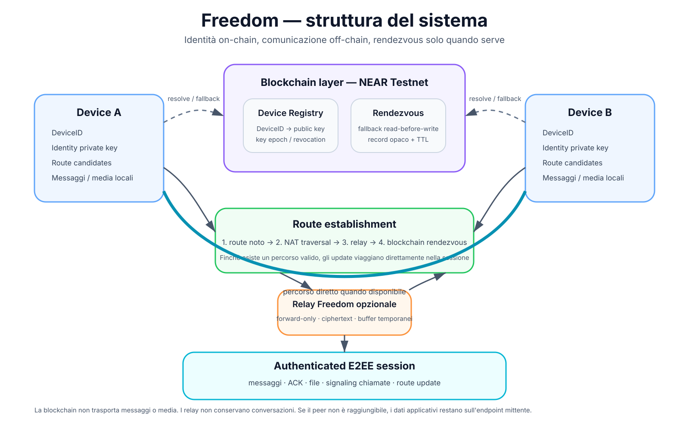

# Freedom

## Protocollo decentralizzato di comunicazione

Freedom è un protocollo decentralizzato di comunicazione che permette a dispositivi identificati crittograficamente di stabilire sessioni sicure senza dipendere da un server centrale di messaggistica.

La blockchain non trasporta messaggi, file, audio o video. Viene usata come registro verificabile delle identità dei dispositivi e come meccanismo di rendezvous di fallback quando due dispositivi online non dispongono più di un percorso valido per raggiungersi.

Il traffico applicativo viaggia fuori dalla blockchain, direttamente tra endpoint oppure attraverso relay transitivi che inoltrano ciphertext senza possedere le chiavi della conversazione.

> Principio operativo: **identity on-chain, communication off-chain, rendezvous on-chain only when needed.**

## Obiettivi

- identità dei dispositivi verificabili crittograficamente;
- cifratura end-to-end obbligatoria;
- nessun server centrale di messaggistica necessario;
- comunicazione diretta quando il percorso di rete lo consente;
- NAT traversal e relay come percorsi alternativi;
- aggiornamenti di route scambiati direttamente durante una sessione attiva;
- scritture blockchain ridotte al minimo tramite read-before-write;
- nessun messaggio persistito nella rete Freedom;
- nessun messaggio o media memorizzato sulla blockchain;
- relay `forward-only`, con buffer limitati e temporanei;
- protocollo indipendente da Android, iOS e dagli store;
- possibilità di sostituire la blockchain tramite un adapter senza cambiare il protocollo applicativo.

## Architettura



Per la consegna di un messaggio applicativo entrambi gli endpoint devono essere online. Se il destinatario non è raggiungibile, il messaggio resta sul dispositivo mittente e non viene disseminato automaticamente nella rete.

## Architettura in una frase

```text
DeviceID -> blockchain identity -> rendezvous fallback -> route -> authenticated E2EE session -> messages/media
```

## Blockchain iniziale

La prima implementazione usa **NEAR Testnet** attraverso un'interfaccia `ChainAdapter`.

NEAR non fa parte del wire protocol Freedom: è la prima implementazione del registro decentralizzato. Il core deve poter supportare in futuro adapter differenti senza cambiare DeviceID, session protocol o formato dei messaggi.

```text
ChainAdapter
  |- NearChainAdapter      <- prima implementazione
  |- ...                   <- future implementazioni
```

## Ruolo della blockchain

La chain mantiene solo stato minimo e verificabile.

### Device identity

```text
DeviceRecord {
    device_id
    identity_public_key
    key_epoch
    status
    protocol_version
}
```

Il `DeviceID` è stabile e non coincide con l'hash della chiave pubblica, così una chiave può essere ruotata o revocata senza cambiare identità.

### Rendezvous

La blockchain viene usata per ristabilire un percorso solo quando non esiste più alcun route Freedom valido tra due endpoint online.

Regola fondamentale:

```text
1. READ
2. se esiste un rendezvous valido -> usa i dati, NON scrivere
3. se non esiste -> WRITE del proprio rendezvous
```

Appena viene ristabilita una sessione, gli aggiornamenti di endpoint, NAT candidate e relay candidate passano direttamente nel canale E2EE. La chain non viene più aggiornata finché esiste almeno un percorso valido.

## Primo contatto

Un contatto Freedom viene scambiato intenzionalmente tramite QR, link, NFC o copia/incolla.

Il QR può contenere:

```text
FreedomContact {
    network
    device_id
    rendezvous_capability
    expires_at?
}
```

`rendezvous_capability` è casuale e può essere monouso o temporanea. Serve a evitare che il primo rendezvous debba esporre pubblicamente una relazione leggibile tra due DeviceID.

Dopo il primo handshake autenticato, i due endpoint derivano un `PairRendezvousSecret` locale usato per generare slot on-chain opachi e rotanti per le riconnessioni successive.

## Routing e NAT

Freedom distingue identità e raggiungibilità.

```text
DeviceID -> chi sei
RouteCandidate -> come posso raggiungerti adesso
```

Un route candidate può contenere:

```text
RouteCandidate {
    transport
    endpoint
    nat_mapping
    relay_hint
    priority
    expires_at
}
```

Non basta monitorare l'IP: sotto NAT possono cambiare porta pubblica, mapping e percorso anche con lo stesso indirizzo esterno.

Ordine preferito di connessione:

```text
1. percorso diretto già noto
2. NAT traversal / hole punching
3. relay Freedom
4. rendezvous blockchain se tutti i percorsi sono persi
```

## Relay

Un relay Freedom è un nodo di transito, non un server di messaggistica.

```text
Alice -> ciphertext -> Relay -> ciphertext -> Bob
```

Un relay:

- non possiede le chiavi E2EE;
- non conserva la conversazione;
- non crea mailbox persistenti;
- usa buffer piccoli, limitati e con TTL;
- può essere sostituito durante la sessione;
- deve applicare limiti di banda, memoria e connessioni.

Principio: **forward, not store**.

## Sessione sicura

Una route non autentica un peer. Dopo aver trovato un percorso, gli endpoint eseguono un handshake autenticato bilateralmente.

La chiave pubblica attesa viene risolta dal `DeviceID` tramite blockchain. Entrambe le parti devono dimostrare il possesso della private key corrispondente.

Il transcript dell'handshake deve legare almeno:

- entrambi i DeviceID;
- key epoch;
- chiavi effimere;
- nonce;
- versione protocollo;
- suite crittografica;
- identificatore della sessione.

Il progetto deve usare primitive e protocolli crittografici standard, non crittografia proprietaria.

## Messaggistica

Una volta stabilita la sessione:

```text
Alice <============================> Bob
          authenticated E2EE
```

Messaggi, ACK, file metadata, signaling chiamate e route update vengono trasportati nel canale sicuro.

Se Bob va offline e non esiste alcun percorso, Alice non deposita automaticamente il messaggio sulla blockchain o sui relay: resta pending localmente.

## Store

Freedom Protocol è separato dai client ufficiali.

I client Android e iOS implementano il livello necessario per la conformità dello store senza modificare il trust model del protocollo:

- blocco locale di un DeviceID;
- segnalazione volontaria con contenuti scelti dall'utente;
- privacy policy e termini;
- permessi minimi;
- nessuna master key;
- nessuna scansione server-side necessaria delle conversazioni E2EE.

Freedom è un sistema di contatti espliciti tramite DeviceID/QR, non una random chat.

## Stato del codice Android

Il codice Android presente nel repository è un **transport/crypto spike precedente alla specifica attuale**. Dimostra socket diretto e handshake cifrato, ma usa ancora IP manuale e fingerprint/TOFU.

Non rappresenta più l'M1 canonico. Verrà rifattorizzato seguendo questa sequenza:

```text
DeviceID
 -> NEAR Testnet identity
 -> QR contact
 -> chain verification
 -> rendezvous
 -> route establishment
 -> mutual authentication
 -> E2EE messaging
```

## Documentazione

- [`docs/ARCHITECTURE.md`](docs/ARCHITECTURE.md) — architettura completa.
- [`docs/PROTOCOL.md`](docs/PROTOCOL.md) — oggetti e flussi del protocollo.
- [`docs/CHAIN.md`](docs/CHAIN.md) — NEAR, Device Registry e rendezvous.
- [`docs/THREAT_MODEL.md`](docs/THREAT_MODEL.md) — modello di sicurezza.
- [`docs/STORE_COMPLIANCE.md`](docs/STORE_COMPLIANCE.md) — separazione protocollo/client e vincoli store.
- [`ANDROID.md`](ANDROID.md) — roadmap Android.

## Roadmap sintetica

```text
M0  specifica
M1  DeviceID + NEAR Testnet + QR
M2  rendezvous read-before-write
M3  authenticated secure session
M4  NAT traversal + route updates
M5  relay forward-only
M6  messaging + attachments
M7  voice/video
M8  iOS + platform wake integration
M9  hardening, testing, interoperability
```

## TODO

- [ ] Brand client ufficiale: **Freedom Messenger** — *Powered by Freedom Protocol*.
- [ ] **Censorship resistance / path diversity:** nessun singolo server, relay, RPC endpoint, provider blockchain o percorso di rete deve costituire un punto unico di controllo o interruzione. Freedom deve poter cambiare route e continuare a funzionare, quando tecnicamente possibile, se singoli relay, endpoint RPC o percorsi vengono bloccati, rimossi o compromessi.

Freedom è definito dalle proprietà tecniche del protocollo: identità verificabile, comunicazione E2EE, routing distribuito, relay non fidati e minima dipendenza dalla blockchain durante una sessione attiva.
