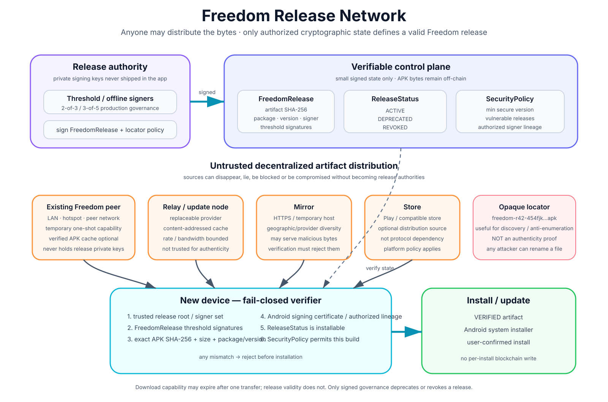
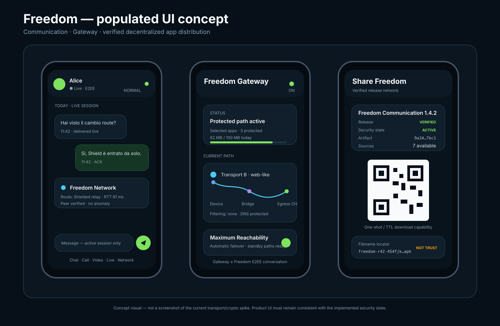

# Freedom — Peer Bootstrap & App Distribution

## 1. Obiettivo

Freedom deve poter essere installato anche **fuori dagli store e da persona a persona** senza rendere obbligatori Google Play, un singolo sito web, un singolo mirror, un singolo relay o un singolo URL permanente.

Caso d'uso principale:

```text
Alice ha già Freedom genuino
Bob non ha Freedom

Alice -> Share Freedom -> mostra QR
Bob   -> fotocamera di sistema -> scansiona QR
      -> ottiene un locator/capability della release
      -> scarica da peer / relay / mirror / update node
      -> verifica release + artifact + signer + policy
      -> installazione esplicitamente confermata dall'utente
```

Principio:

> **la rete distribuisce byte non fidati; la crittografia e il control-plane decidono quali byte sono una release Freedom installabile.**

### Diagramma della Freedom Release Network



Il diagramma rende esplicita la separazione fra **release authority**, **control-plane verificabile**, **sorgenti non fidate dei byte** e **verifier fail-closed sul nuovo device**.

---

## 2. Nessuna chiave privata ufficiale nel client

La chiave privata che autorizza una release Freedom **non deve mai essere incorporata nell'APK** e non deve essere necessaria per premere `Share Freedom`.

Separazione:

```text
OFFLINE / RELEASE SIGNERS
  autorizzano una release
  firmano manifest / policy / locator di release

INSTALLED FREEDOM CLIENT
  possiede solo materiale pubblico per verificare
  può redistribuire manifest, locator e artifact già autorizzati
  può creare capability temporanee locali per il proprio endpoint di download
```

Un client compromesso non deve poter creare una nuova release ufficiale.

---

## 3. Nome file e ReleaseLocator

Un nome come:

```text
freedom-454fjk4hfhsjhslllshlvhvru0ujwr8w.apk
```

può essere utile come **locator opaco / anti-enumeration hint**, ma il nome del file non è una prova di autenticità: un attacker può rinominare qualunque APK.

Il modello corretto è un locator firmato:

```text
FreedomReleaseLocator {
    locator_version
    release_id
    release_nonce
    manifest_hash
    artifact_sha256
    package_id
    version_code
    channel
    issued_at
    expires_at?
    signatures[]
}
```

`release_nonce` è casuale ad alta entropia. Il locator è valido solo se le firme appartengono al signer set Freedom autorizzato.

Il filename può contenere una rappresentazione abbreviata/opaca del locator:

```text
freedom-<release_id>-<locator_tag>.apk
```

Esempio puramente illustrativo:

```text
freedom-r42-454fjk4hfhsjhslllshlvhvru0ujwr8w.apk
```

ma la verifica non deve mai essere:

```text
filename looks valid -> install
```

Deve essere:

```text
signed locator valid
AND manifest valid
AND artifact hash exact
AND Android signer authorized
AND release policy permits install
-> installable
```

---

## 4. Share capability temporanea

Quando Alice preme `Share Freedom`, non firma una nuova release. Genera soltanto una capability locale temporanea per servire **una release già verificata**:

```text
PeerTransferCapability {
    transfer_nonce
    release_id
    artifact_sha256
    source_endpoint
    expires_at
    max_downloads?
}
```

Questa capability può essere autenticata con una chiave effimera del peer/sessione o protetta da un token CSPRNG. Non concede autorità sulla release.

Può essere:

- one-shot;
- a TTL breve;
- limitata a N download;
- revocata chiudendo l'endpoint locale.

Consumare la capability **non revoca la release globale**.

---

## 5. Install QR

Il client espone:

```text
Share Freedom
  -> Install QR
```

Il destinatario può non avere Freedom installato, quindi il QR deve essere utilizzabile dalla fotocamera/browser di sistema.

Descriptor concettuale:

```text
FreedomInstallDescriptor {
    version
    channel
    package_id
    release_id
    release_locator_hash
    release_manifest_hash
    source_hints[]
    peer_transfer_capability?
    expires_at
}
```

Il descriptor è un **locator**, non una root of trust. Non può ridefinire le chiavi ufficiali Freedom.

---

## 6. Decentralized Release Network

La stessa release deve poter essere trovata tramite più sorgenti indipendenti:

```text
PEER_LOCAL
PEER_NETWORK
COMMUNITY / UPDATE RELAY
MANAGED UPDATE NODE
PRIVATE MIRROR
HTTPS MIRROR
STORE
future transport
```

La rete può usare indirizzamento content-addressed:

```text
artifact key = SHA-256(APK bytes)
manifest key = SHA-256(canonical FreedomRelease)
```

Un nodo può quindi chiedere:

```text
GET artifact_sha256 = X
```

senza dover fidarsi del nodo che risponde.

Più peer possono seedare gli stessi byte verificati. Nessun nodo di distribuzione possiede la release authority.

---

## 7. Release state sul control-plane

Il control-plane non registra ogni installazione e non banna una release dopo il primo download.

Mantiene invece uno stato piccolo e verificabile per la release:

```text
ReleaseStatus {
    release_id
    artifact_sha256
    status
    min_secure_version
    policy_epoch
    reason_hash?
    remediation_release?
    issued_at
    signatures[]
}
```

Stati minimi:

```text
ACTIVE
DEPRECATED
REVOKED
```

Semantica:

```text
ACTIVE      -> installabile secondo normale policy
DEPRECATED  -> installabile solo se policy lo consente; mostra update raccomandato
REVOKED     -> non installare / non aggiornare a questa release
```

Una release viene `REVOKED` solo per motivi di sicurezza/compromissione/policy, non perché un singolo utente l'ha installata.

Nessuna write per singola installazione significa anche **nessuna telemetria on-chain necessaria sul numero o timing degli install**.

---

## 8. Release manifest

Oggetto canonico:

```text
FreedomRelease {
    manifest_version
    release_id
    version_code
    version_name
    package_id
    artifact_sha256
    artifact_size
    signing_cert_fingerprint
    signing_lineage_commitment?
    min_supported_version
    min_secure_version
    criticality
    release_locator_hash
    issued_at
    signatures[]
}
```

La release authority firma il **manifest canonico**, non il nome del file.

In production le firme critiche dovrebbero usare governance multi-key/threshold invece di una singola chiave online.

---

## 9. Verifica prima dell'installazione

Il verifier deve eseguire almeno:

```text
1. obtain candidate artifact from any source
2. compute SHA-256 over exact APK bytes
3. resolve/obtain FreedomRelease
4. verify release threshold signatures / pinned release root
5. verify ReleaseStatus != REVOKED
6. verify package_id
7. verify version_code / anti-downgrade policy
8. verify artifact_size + artifact_sha256
9. verify Android APK signing certificate / authorized lineage
10. verify current SecurityPolicy / min_secure_version
11. only then invoke Android system installer
```

Qualunque mismatch -> **fail closed**.

Il relay/mirror/peer può mentire sul contenuto ma non deve poter produrre contemporaneamente hash, firme e signer lineage validi per byte modificati.

---

## 10. Android signing come seconda barriera

Freedom usa anche la firma APK nativa Android.

Per un aggiornamento di un'app già installata, Android verifica la continuità del certificato/lineage del package. Freedom aggiunge sopra questo controllo la propria verifica di manifest e policy.

Quindi le barriere sono separate:

```text
Freedom release signatures
        +
artifact content hash
        +
Android APK signing certificate / lineage
        +
SecurityPolicy / ReleaseStatus
```

Nessuna singola barriera deve essere trattata come sufficiente da sola.

---

## 11. Primo install: problema della root of trust

Un dispositivo che non ha mai visto Freedom non può distinguere matematicamente una chiave ufficiale da una chiave inventata dall'attaccante se **tutte** le informazioni arrivano dallo stesso attaccante.

Per il primo sideload serve quindi almeno una root pubblica già fidata o verificata indipendentemente:

```text
pinned Freedom release root nel bootstrap verifier
store verificato
fingerprint release root verificato out-of-band
più canali indipendenti che confermano lo stesso root
trusted existing Freedom client + verifier indipendente
```

Il progetto deve minimizzare questa bootstrap trust surface, ma non fingere che possa essere eliminata per magia.

---

## 12. Offline / control-plane degraded

La distribuzione deve continuare a funzionare anche se una singola RPC è bloccata.

Il verifier usa:

- più RPC/control-plane provider;
- manifest firmati verificabili offline;
- ultima `SecurityPolicy` valida cacheata;
- expiry/epoch bounded;
- failover provider;
- peer/relay/mirror come sorgenti non autoritative.

Per release sensibili, se lo stato di revoca è troppo vecchio rispetto alla policy di freschezza, il verifier può richiedere una verifica più recente prima di installare invece di accettare ciecamente uno stato stale.

---

## 13. Peer-local transfer

```text
Alice Freedom
  -> seleziona current verified artifact
  -> apre endpoint temporaneo read-only
  -> crea PeerTransferCapability
  -> mostra QR

Bob
  -> ottiene descriptor/locator
  -> scarica artifact
  -> verifica completamente
  -> installer Android
```

Endpoint:

- temporaneo;
- capability-protected;
- rate-limited;
- solo artifact previsto;
- TTL breve;
- nessun file server generico.

---

## 14. Difesa contro app farlocche

Threats:

```text
attacker rinomina fake.apk con nome Freedom credibile
attacker copia un locator valido ma serve byte differenti
malicious mirror / relay
old vulnerable release
fake package con stessa icona/nome
same package_id + unauthorized signer
modified APK after signing
compromised release signer
stale policy che non include ancora una revoca
```

Difese:

- filename non autoritativo;
- signed `FreedomReleaseLocator`;
- signed `FreedomRelease`;
- SHA-256 content addressing;
- APK signer/lineage verification;
- release status ACTIVE/DEPRECATED/REVOKED;
- min secure version e anti-downgrade;
- threshold release governance;
- multi-RPC/control-plane verification;
- fail closed su mismatch;
- policy freshness per revoche critiche.

---

## 15. Store build vs Direct build

### Google Play build

Usa install/update conforme allo store. `Share Freedom` può portare alla listing ufficiale.

### Freedom Direct

Può usare:

```text
signed release locator
content-addressed artifact discovery
peer-local transfer
peer-network / relay / mirror
FreedomRelease verification
ReleaseStatus / SecurityPolicy verification
Android PackageInstaller
```

L'installazione resta user-initiated secondo le regole della piattaforma.

---

## 16. UX proposta



Il visual è un **concept di prodotto**, non uno screenshot del transport/crypto spike Android corrente. Le label di sicurezza mostrate nella UI devono comparire solo quando il relativo stato è realmente verificato dal client.

Client esistente:

```text
Share Freedom

Freedom Communication 1.4.2
Release       VERIFIED
Security      ACTIVE
Artifact      9a34…7bc1
Sources       7 available
Share link    expires in 10 min

[ QR ]
```

Verifier sul nuovo dispositivo:

```text
Freedom Communication
Version        1.4.2
Release signer VERIFIED
APK signer     VERIFIED
Artifact hash  VERIFIED
Security state ACTIVE
Source         Peer / Relay / Mirror

Install
```

Mai mostrare `Source: Peer` come prova di autenticità.

---

## 17. Invarianti

- chiave privata di release mai dentro il client;
- il client può condividere una release senza poter autorizzare nuove release;
- filename/URL/capability non sono prove di autenticità;
- signed locator + signed manifest + exact artifact hash + Android signer + current policy devono concordare;
- artifact distribuiti da una rete decentralizzata e non fidata;
- peer/relay/mirror sono intercambiabili e non autoritativi;
- una release non viene revocata perché un utente la installa;
- `REVOKED` è uno stato di sicurezza globale firmato;
- capability di trasferimento possono essere one-shot/TTL senza chain write per installazione;
- first install richiede una root of trust indipendente;
- nessuna singola URL/IP/store è requisito permanente della Direct build;
- compromissione di un nodo di distribuzione non deve permettere di produrre una Freedom valida.
