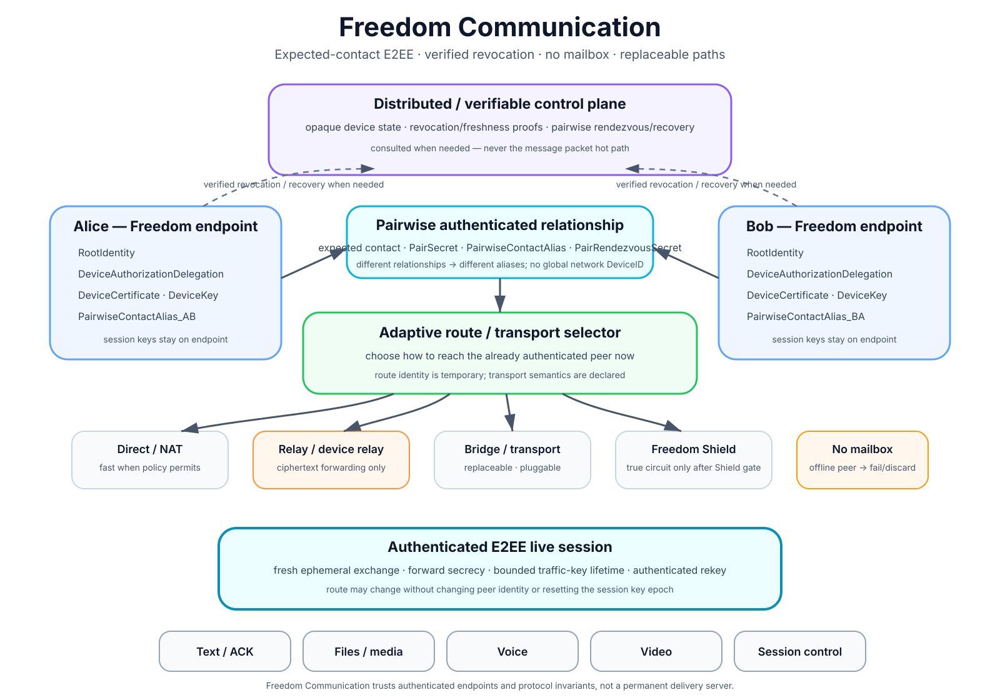

# Freedom — Architecture

> **Specifica target.** L'implementazione Android/NEAR corrente diverge in modo esplicito; vedi [`IMPLEMENTATION_STATUS.md`](IMPLEMENTATION_STATUS.md).

## 1. Definizione

Freedom è un sistema di comunicazione sincrona e resilienza di rete che separa esplicitamente:

1. **ownership identity** — chi possiede e recupera l'identità Freedom;
2. **device authorization** — quali DeviceKey sono autorizzate;
3. **verifiable control-plane** — rotation/revocation, entitlement, recovery e policy;
4. **pairwise identity/rendezvous** — come due contatti si autenticano e si ritrovano;
5. **routing/transport fabric** — come vengono scelti path, relay, bridge e transport;
6. **Freedom Communication** — sessione E2EE live tra endpoint Freedom;
7. **Freedom Gateway** — percorso opzionale per traffico di app esterne verso un Internet egress;
8. **application layer** — messaggi, file, audio, video e funzioni client.

La prima implementazione del control-plane usa una blockchain, ma chat, media, Gateway payload e APK rimangono off-chain.

## 2. Vista d'insieme

```text
                  DISTRIBUTED / VERIFIABLE CONTROL PLANE
      +---------------------------------------------------------+
      | Root identity / device authorization                    |
      | key rotation / revocation                               |
      | pairwise rendezvous / recovery                          |
      | entitlement / sponsorship                               |
      | emergency / security / release manifests                |
      +----------------------------+----------------------------+
                                   |
                           only when needed
                                   |

+---------------------+                               +---------------------+
| Alice               |                               | Bob                 |
| RootIdentity        |                               | RootIdentity        |
| DeviceKey           |                               | DeviceKey           |
| device commitment   |                               | device commitment   |
+----------+----------+                               +----------+----------+
           |                                                     |
           +----------- pairwise authenticated state ------------+
                                   |
                         path / transport selector
                                   |
             +---------------------+---------------------+
             |                                           |
             v                                           v
   FREEDOM COMMUNICATION                         FREEDOM GATEWAY
   direct / relay / Shield                      app/device traffic
             |                                           |
   authenticated E2EE live                      relay/bridge/Shield
             |                                           |
 text / file / voice / video                    explicit Internet Egress
                                                         |
                                                      Internet
```

Il control-plane è fondamentale come **funzione distribuita e verificabile** del trust model attuale. NEAR è soltanto la prima implementazione tramite `ChainAdapter`.

## 3. Due security boundaries differenti

### Freedom Communication



```text
Freedom endpoint A
      <==== authenticated E2EE ====>
Freedom endpoint B
```

Le session key restano agli endpoint. Relay, RPC e provider di rete non sono trust anchor della conversazione.

Il percorso selezionato può cambiare tra direct, NAT, relay, bridge, Shield o multi-hop senza cambiare la relazione autenticata tra i peer. Il route layer trasporta la sessione; non definisce l'identità del contatto.

### Freedom Gateway

```text
external app
   -> encrypted Freedom tunnel
   -> relay / bridge / Shield
   -> explicit Egress
   -> Internet
```

Il Gateway protegge il percorso fino all'egress, ma la sicurezza oltre l'egress dipende anche dal protocollo applicativo finale.

Per esempio:

- HTTPS mantiene cifratura applicativa verso il sito;
- HTTP plaintext può essere osservabile dall'egress;
- un egress vede metadata di destinazione necessari al forwarding.

Quindi il Gateway **non deve essere descritto come equivalente all'E2EE Freedom-to-Freedom**.

Dettagli: [`GATEWAY.md`](GATEWAY.md).

## 4. Identity plane

Freedom non usa un `DeviceID` globale come identità pubblica o identificatore di trasporto.

```text
RootIdentity             -> ownership / recovery / entitlement
DeviceKey                -> chiave operativa del device
DeviceRecordCommitment   -> handle opaco del control-plane
PairwiseContactAlias     -> alias specifico della relazione
TransportToken           -> token temporaneo di route/circuito
Session keys             -> materiale effimero E2EE
```

Il `DeviceRecordCommitment` serve per lookup, key rotation e revocation ma non è username, contact ID o indirizzo di rete.

Dettagli: [`IDENTITY_MODEL.md`](IDENTITY_MODEL.md).

## 5. Device authorization

```text
DeviceRecord {
    version
    device_record_commitment
    device_public_key
    key_epoch
    status
    protocol_version
    authorization_proof
}
```

La RootIdentity autorizza il device:

```text
ActivateDevice {
    root_commitment
    device_record_commitment
    device_public_key
    entitlement_epoch
    nonce
    root_signature
}
```

Gli stati minimi sono `ACTIVE` e `REVOKED`.

Una rotazione incrementa `key_epoch`; il commitment tecnico può restare stabile durante la rotazione senza diventare una global network identity.

## 6. Contact bootstrap

La rubrica rappresenta persone/RootIdentity, non singoli telefoni.

```text
Bob / RootIdentity
  |- Phone
  |- Tablet
  `- Desktop
```

Il contatto può essere scambiato via QR, link, NFC o altro canale esterno.

```text
FreedomContact {
    version
    network_id
    root_identity_proof
    contact_capability
    bootstrap_device_certificate?
    bootstrap_route_hints[]?
    expires_at?
}
```

La `contact_capability` è casuale ad alta entropia e può essere one-shot o temporanea.

## 7. Pairwise identity e rendezvous

Dopo il primo handshake autenticato:

```text
PairSecret_AB
PairwiseContactAlias_AB
PairRendezvousSecret_AB
```

Alias differenti vengono usati per relazioni differenti.

Da `PairRendezvousSecret` derivano slot opachi e rotanti. Il secret non viene pubblicato.

### Read-before-write

```text
1. try local known routes
2. try allowed relay/bridge paths
3. read peer pairwise slot
4. if usable -> connect, no write
5. read own slot
6. if already valid -> wait/poll
7. otherwise write one bounded offer
```

## 8. Rendezvous record

```text
RendezvousRecord {
    version
    expires_at
    ciphertext
}

RendezvousPayload {
    sender_pairwise_alias
    sender_device_proof
    sender_key_epoch
    rendezvous_nonce
    route_candidates[]
    relay_candidates[]
    transport_hints[]?
    ephemeral_transport_public_key
}
```

Il record pubblico non deve esporre una relazione leggibile RootIdentity/device/route.

## 9. Route and transport fabric

```text
RouteCandidate {
    transport
    endpoint
    candidate_type
    priority
    observed_at
    expires_at
}
```

Un IP non rappresenta un'identità Freedom.

Classi di path:

```text
DIRECT
NAT_TRAVERSAL
RELAY
BRIDGE
SHIELDED
MULTI_HOP
PLUGGABLE / OBFUSCATED TRANSPORT
```

Il path selector può usare:

- policy privacy;
- RTT;
- stabilità recente;
- costo/capacità;
- disponibilità del transport;
- rischio di censura/blocco;
- provider/ASN diversity;
- preferenze utente;
- battery/data policy.

Nessuna autorità centrale decide il percorso.

## 10. Transport abstraction

Il network layer usa capability temporanee e adapter sostituibili:

```text
TransportToken
RelayCircuitToken
NextHopToken
RouteCapability
```

Interfaccia concettuale:

```text
TransportAdapter {
    connect(candidate, policy)
    probe_capabilities()
    health()
    classify_failure()
    close()
}
```

Classi future possono includere:

```text
native TLS/TCP
UDP / QUIC-like carrier
HTTPS / WebSocket-like carrier
HTTP/2 or HTTP/3 tunnel
bridge transport
obfuscated transport
active-probing-resistant transport
WebTunnel-like transport
ephemeral proxy transport
```

Freedom dovrebbe riutilizzare transport anti-censura esistenti e reviewati quando appropriato, invece di inventare primitive proprietarie senza necessità.

## 11. Censorship resistance

Invariante:

> **nessun singolo fingerprint, protocollo, IP, dominio, relay, RPC, provider o transport deve essere requisito permanente.**

```text
direct blocked       -> another route
relay A blocked      -> relay B / bridge
RPC A blocked        -> RPC B
transport A filtered -> transport B
public pool blocked  -> non-public / pairwise bridge
```

Non esiste garanzia universale contro ogni firewall. Un avversario può applicare allowlist totale o eliminare ogni connettività.

Obiettivo corretto:

> **se esiste almeno un carrier ancora utilizzabile, Freedom deve tentare automaticamente strategie indipendenti per trovare un percorso valido.**

## 12. Adaptive Defense

Dopo la perdita completa del path, peer già autenticati possono usare `RecoveryBeacon` pairwise, cifrati e a TTL breve.

```text
RecoveryBeacon {
    version
    issued_at
    expires_at
    recovery_nonce
    route_generation
    state
    candidate_hints[]?
}
```

```text
control-plane reachable          yes
peer activity recent             yes
current data path                fail
        |
        v
INTERFERENCE_OR_ROUTE_FAILURE_SUSPECTED
        |
        v
alternate route / relay / bridge / transport
```

Vincoli:

- niente heartbeat on-chain continui;
- slot pairwise opachi e rotanti;
- payload cifrato;
- TTL breve;
- backoff/rate limit;
- stop delle write dopo recovery;
- nessun claim di rilevamento della sorveglianza passiva.

Dettagli: [`ADAPTIVE_DEFENSE.md`](ADAPTIVE_DEFENSE.md).

## 13. Relay architecture

Un relay Freedom può essere:

```text
VPS / VM
server dedicato
mini PC / Raspberry Pi
community node
managed node
private organization node
telefono / tablet / desktop Freedom opt-in
```

Un normale device può svolgere:

```text
ENDPOINT -> sessioni del proprio utente
RELAY    -> inoltro ciphertext di altri circuiti
```

```text
RelayCandidate {
    relay_id
    relay_class
    endpoint
    transport
    capability_token?
    capacity_hint?
    expires_at
}
```

Classi iniziali:

```text
DEDICATED
COMMUNITY
DEVICE
PRIVATE
MANAGED
```

Requisiti relay:

- payload Freedom E2EE;
- niente mailbox persistenti;
- buffer/TTL bounded;
- quote/rate limit;
- nessuna fiducia per autenticità del contenuto;
- device relay opt-in e resource-bounded;
- nessun arbitrary Internet proxy nel relay base.

Dettagli: [`RELAYS.md`](RELAYS.md).

## 14. Relay != Egress

Questa separazione è obbligatoria.

```text
DEVICE_RELAY / COMMUNITY_RELAY
    Freedom circuit -> Freedom circuit
    no arbitrary Internet exit

MANAGED_EGRESS / PRIVATE_EGRESS / BUSINESS_EGRESS
    Gateway tunnel -> Internet
```

Un Relay Contributor non deve trasformare inconsapevolmente il proprio telefono o IP domestico in un exit node aperto.

## 15. Freedom Gateway

Freedom Gateway è post-V1 e usa le primitive di path/transport già sviluppate per Freedom Communication.

```text
Android app traffic
      |
      v
local VpnService
      |
 encrypted tunnel
      |
path selector
  |- direct to egress
  |- relay -> egress
  |- bridge -> egress
  `- Shield / multi-hop -> egress
      |
   Internet
```

Modalità previste:

```text
OFF
SELECTED_APPS
WHOLE_DEVICE
```

Requisiti:

- consenso esplicito;
- split tunnel configurabile;
- DNS/leak controls;
- kill-switch opzionale;
- egress diversity;
- route/transport status visibile;
- nessun egress implicito su community/device relay;
- nessun claim di anonimato assoluto.

Dettagli: [`GATEWAY.md`](GATEWAY.md).

## 16. Maximum Reachability

Modalità futura:

```text
MAXIMUM_REACHABILITY
  multiple transport strategies
  bounded warm alternatives
  independent providers
  non-public bridges after filtering evidence
  parallel connect when allowed
  aggressive failover
  bounded probing/backoff
```

L'obiettivo è massimizzare la probabilità di stabilire un percorso in reti restrittive, non garantire matematicamente il bypass di qualsiasi firewall.

## 17. Secure session

Trovare un endpoint non significa aver autenticato il peer.

L'handshake verifica:

1. RootIdentity/contact identity attesa;
2. autorizzazione della DeviceKey corrente;
3. possesso della DeviceKey;
4. transcript effimero della sessione.

Il transcript lega almeno:

```text
protocol_version
network_id
pairwise aliases
current device authorization proofs
key epochs
ephemeral keys
nonces
negotiated_suite
session_id
```

Il relay non partecipa come authority all'autenticazione endpoint-to-endpoint.

## 18. Synchronous delivery

```text
active authenticated session?
  yes -> transmit
  no  -> discard / fail locally
```

Nessuna mailbox di consegna futura nel protocollo base.

## 19. Live mode

Il client può offrire una modalità Live che evita persistenza locale della cronologia e distrugge session state/key al termine.

Questa proprietà è locale e non impedisce al peer remoto o a un OS compromesso di conservare contenuti ricevuti.

## 20. Chain adapter

```text
interface ChainAdapter {
    registerRoot(...)
    registerDeviceRecord(...)
    resolveDeviceRecord(...)
    rotateDeviceKey(...)
    revokeDeviceRecord(...)
    readRendezvous(...)
    writeRendezvous(...)
    verifyState(...)
}
```

La prima implementazione è `NearChainAdapter` su NEAR Testnet.

## 21. Fee relayer

Un fee relayer:

- paga gas;
- non possiede RootIdentity o DeviceKey;
- non può firmare come endpoint;
- non deve essere unico;
- può essere sostituito senza cambiare protocollo.

## 22. Application layer

Freedom Communication trasporta nella sessione sicura:

```text
text
ACK
attachments
call signaling
voice
video
route updates
session control
```

Il registro distribuito non è nel packet hot path.

Freedom Gateway trasporta pacchetti/tunnel di app esterne verso egress espliciti, in un security boundary separato.

## 23. Share Freedom

```text
peer / relay / mirror / store
        -> artifact bytes
        -> verify FreedomRelease/hash/signer
        -> install via platform
```

La sorgente dei byte non è un trust anchor.

Dettagli: [`APP_DISTRIBUTION.md`](APP_DISTRIBUTION.md).

## 24. Proprietà architetturali

Freedom mira a mantenere queste invarianti:

- RootIdentity indipendente dal percorso;
- nessun `DeviceID` globale necessario al network layer;
- DeviceRecordCommitment opaco e solo control-plane;
- contatto logico = persona/RootIdentity;
- alias pairwise tra contatti;
- token di trasporto temporanei;
- sessione Freedom autenticata indipendentemente dal relay;
- comunicazione sincrona senza mailbox di rete;
- registro non necessario per ogni pacchetto o cambio route;
- relay incapace di leggere contenuto Freedom E2EE;
- direct path non obbligatorio;
- bootstrap, RPC, relay, egress e fee relayer sostituibili;
- nessun singolo transport obbligatorio;
- recovery beacon pairwise/temporanei;
- `DEVICE_RELAY` separato da Internet egress;
- Gateway e Communication con trust model esplicitamente distinti;
- nessun claim di universal firewall bypass;
- scritture on-chain proporzionali a identity/control events e recovery, non al volume di comunicazione o Gateway traffic.
