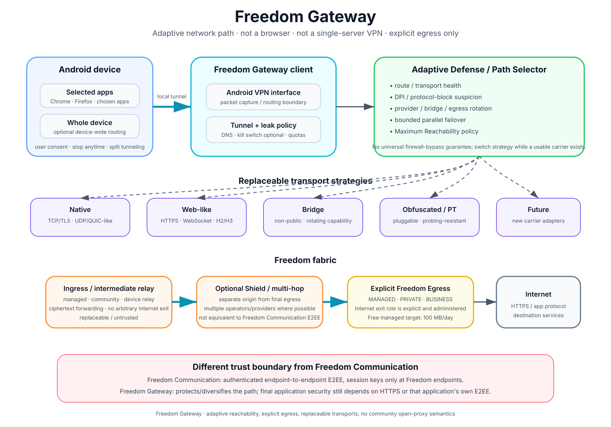

# Freedom — Product Scope

## 1. Obiettivo

Freedom Communication non deve competere al lancio sulla quantità di feature. Deve dimostrare in modo affidabile la proposta centrale di Freedom Protocol: **comunicazione privata live, autenticata E2EE, sincrona, senza mailbox centrale e senza dipendenza permanente da un singolo percorso o provider.**

Principio UX:

> **Semplice quando tutto funziona. Trasparente quando qualcosa cerca di impedirti di comunicare.**

Freedom è anche un prodotto per utenti che hanno bisogno di capire lo stato reale della propria capacità di comunicare.

## 2. Launch scope — V1

La prima release pubblica è focalizzata sul **1:1**.

Funzioni essenziali:

- RootIdentity + DeviceKey inizializzate localmente;
- DeviceRecordCommitment opaco per authorization/revocation, senza global DeviceID di rete;
- Recovery Kit esportabile: QR/bundle cifrato + recovery code;
- registrazione sponsorizzata quando serve, senza wallet NEAR obbligatorio;
- aggiunta contatto-persona tramite QR/link con alias pairwise dopo handshake;
- **Share Freedom / Install QR** per permettere a un nuovo utente di ottenere l'app partendo da un client esistente;
- build Direct capace di indicare/servire un artifact verificato tramite peer locale, relay o mirror;
- build Play che usa il percorso di install/update conforme allo store;
- **10 contatti attivi nel piano Free**;
- **1 device attivo nel piano Free**;
- sessione autenticata E2EE;
- text 1:1;
- foto/video/file;
- messaggi vocali;
- chiamata audio 1:1;
- videochiamata 1:1;
- Live/ephemeral mode;
- stato peer/sessione comprensibile;
- route selection/privacy policy;
- relay forward-only;
- possibilità opt-in per un dispositivo Freedom di contribuire come relay;
- **Relay Contributor: +10 contatti attivi** per utenti Free qualificati;
- Adaptive Defense base;
- Freedom Network Indicator;
- Emergency Shield Free con quota da dimensionare con dati reali;
- blocco contatto e requisiti store minimi.

L'utente non deve essere obbligato a comprendere account NEAR, gas, RPC, NAT, relay, commitment o primitive crittografiche nell'uso normale.

Dettagli identità: [`IDENTITY_MODEL.md`](IDENTITY_MODEL.md).

## 3. Recovery e multi-device

```text
Recovery Kit
 -> RootIdentity
 -> NEW DeviceKey
 -> NEW DeviceRecordCommitment
 -> device activation
 -> entitlement restore
```

La chain fa rispettare `max_devices`; il restore non deve permettere di usare una licenza su telefoni illimitati.

Un contatto nella rubrica rappresenta una persona/RootIdentity. Se la stessa persona autorizza più device, non consuma più contact slot.

Dettagli: [`ACCOUNT_RECOVERY_LICENSES.md`](ACCOUNT_RECOVERY_LICENSES.md).

## 4. Contatti Free e Relay Contributor

Il limite Free base è **10 contatti attivi**.

- non è un limite lifetime;
- eliminare/disattivare un contatto libera uno slot;
- un contatto rappresenta una persona, non ogni device;
- la lista contatti resta locale e cifrata;
- non pubblicare social graph in chiaro;
- eventuale enforcement anti-tampering deve usare commitment/slot opachi.

Un utente Free che abilita e mantiene un contributo `DEVICE_RELAY` utile alla rete ottiene **10 slot aggiuntivi**:

```text
Free                     10 active contacts
Free + Relay Contributor 20 active contacts
```

Il bonus non è permanente solo perché il toggle relay è stato acceso una volta. Deve essere collegato a una policy minima di contributo verificabile e privacy-preserving.

Se il benefit scade, Freedom non cancella automaticamente i contatti sopra quota; blocca soltanto l'aggiunta di nuovi contatti finché l'utente non torna entro il limite o riqualifica il relay.

Dettagli: [`RELAYS.md`](RELAYS.md).

## 5. Device Relay

Un telefono/tablet/desktop Freedom può agire anche come nodo di forwarding per altri peer.

La funzione è opt-in nei client ufficiali e deve rispettare limiti configurabili di batteria, rete, CPU, RAM, banda e numero di circuiti.

Un device relay non deve necessariamente avere un IP pubblico: può essere utile tramite NAT mapping, transport alternativi o connessioni outbound già stabilite verso il fabric Freedom.

Essere relay non concede accesso a plaintext o session keys. Il relay usa token/capability di circuito temporanei e non deve ricevere RootIdentity/device commitment quando non necessari.

Un `DEVICE_RELAY` non diventa automaticamente un Internet egress: il Gateway usa solo egress espliciti managed/private/business.

## 6. Share Freedom / distribuzione peer-to-peer dell'app

Un client già installato deve poter mostrare un QR dedicato all'installazione:

```text
Alice: Share Freedom
        -> [Install QR]

Bob:   camera di sistema
        -> download
        -> verifica release
        -> installazione
```

Il QR non è il Contact QR e deve funzionare anche quando Bob non ha ancora Freedom installato.

Sorgenti possibili:

```text
STORE
PEER_LOCAL
RELAY
MIRROR
PEER_NETWORK
```

La build Direct può mantenere opzionalmente in cache un **APK standalone già verificato** e servirlo tramite endpoint temporaneo/capability. Non è necessario incorporare una seconda copia dell'APK dentro il client.

La sorgente del file non è la sorgente di fiducia. Prima dell'installazione devono concordare almeno:

```text
FreedomRelease signatures
artifact SHA-256
package ID
version code
signing certificate / authorized lineage
SecurityPolicy
```

Per il primo sideload deve esistere un trust anchor indipendente dal peer/relay: store, bootstrap autenticato, release root verificato out-of-band o verifier con root pinned.

Dettagli: [`APP_DISTRIBUTION.md`](APP_DISTRIBUTION.md).

## 7. Pagamenti e Pro

Freedom supporta payment adapter multipli:

```text
PayPal
crypto/stablecoin
future providers
```

PayPal può essere aperto dall'app senza API pubblica Freedom; worker privati outbound-only verificano il pagamento e pubblicano l'attestazione. Crypto verificabile on-chain può attivare direttamente l'entitlement.

Il callback client non è prova autoritativa di pagamento e nessun merchant secret deve stare nell'APK.

Dettagli: [`PAYMENTS.md`](PAYMENTS.md).

## 8. Adaptive Defense e Network Indicator

Il client deve mostrare uno stato rete sempre accessibile:

```text
NORMAL
SHIELDED
DEGRADED
SUSPECTED
UNAVAILABLE
```

In caso di incidente significativo il pannello può aprirsi automaticamente e distinguere fatti osservati da inferenze.

Core Free:

- route health;
- RPC/provider fallback;
- relay/path fallback;
- recovery rendezvous pairwise;
- `peer recently active + data path unavailable`;
- route switch automatico;
- stessa diagnosi tecnica di Pro;
- quota Emergency Shield quando disponibile.

Pro/Shield può aggiungere Always-Shielded, multi-hop, relay gestiti multipli, candidate pre-warmed, parallel failover, transport rotation aggressiva e Maximum Resilience.

## 9. Emergency bulletin e secure updates

Freedom deve poter ricevere bulletin firmati globali o geolocalizzati. Il matching geografico avviene localmente senza pubblicare la posizione dell'utente on-chain.

Gli aggiornamenti usano `FreedomRelease` firmati con hash/versione/signing fingerprint. L'APK resta off-chain e può essere scaricato da store, mirror temporanei, peer/relay Freedom o altri transport compatibili.

Una `SecurityPolicy` critica può disabilitare selettivamente funzioni/versioni vulnerabili, mantenendo recovery/update quando sicuro. Non deve esistere un kill-switch commerciale arbitrario.

Dettagli: [`EMERGENCY_UPDATES.md`](EMERGENCY_UPDATES.md).

## 10. Cosa NON blocca il primo lancio

Non sono prerequisiti della prima release pubblica:

- gruppi testuali;
- group voice/video;
- community pubbliche;
- bot/feed/social graph;
- mailbox offline;
- cloud history sync;
- Maximum Resilience completa;
- bridge/non-public pool avanzato;
- padding avanzato;
- update swarm completo se esiste già un canale sicuro di distribuzione V1;
- incentivi economici/tokenizzati ai relay oltre al bonus contatti;
- browser web integrato;
- **Freedom Gateway a livello dispositivo**.

Il Gateway è un'evoluzione post-V1 costruita sulle stesse primitive di routing/relay/Shield e non deve rallentare Freedom Communication core.

## 11. Live Groups — V1.5

I gruppi devono preservare la semantica sincrona:

```text
Alice online  -> delivered
Bob online    -> delivered
David offline -> not delivered
```

Nessuna mailbox condivisa automatica per gli assenti.

Scope iniziale:

- piccoli gruppi testuali;
- media;
- membership autenticata;
- invito QR/link/capability;
- presenza minima;
- modalità effimera.

## 12. Freedom Live Rooms

Una **Live Room** è una sessione privata multi-party che serve le persone presenti adesso, non una mailbox permanente.

```text
explicit invite
authenticated membership
E2EE
history optional/off
Live mode
no server-side mailbox
no automatic offline delivery
```

## 13. Multi-party voice/video — V2

Non usare mesh P2P illimitata per gruppi grandi. Per media multi-party usare forwarding scalabile/SFU compatibile con il trust model:

- nodo media non è identity trust anchor;
- più operatori/nodi;
- sostituibile;
- nessun singolo SFU requisito permanente;
- design E2EE multi-party reviewato separatamente.

## 14. Registrazione ed economia Free

L'installazione non produce automaticamente una write on-chain.

```text
RootIdentity
 -> anti-abuse proof / adaptive PoW
 -> sponsorship unused
 -> relayer rate limit
 -> bounded global budget
 -> register
```

Messaggi/chiamate non devono essere limitati per pagare il gas blockchain. Il costo chain deve dipendere da eventi rari del control-plane.

Dettagli: [`REGISTRATION_ECONOMICS.md`](REGISTRATION_ECONOMICS.md).

## 15. Roadmap prodotto

```text
V1 — Launch
  RootIdentity + DeviceKey + opaque device record
  pairwise contacts / aliases
  Recovery Kit
  sponsored registration
  Share Freedom / Install QR
  verified peer/relay app bootstrap (Direct build)
  1 active device Free
  10 active contacts Free
  device/community relay
  Relay Contributor +10 contact slots
  1:1 text/media/file
  voice messages
  audio/video call
  Live mode
  basic Adaptive Defense
  Network Indicator
  payment/entitlement foundation

Security plane
  emergency bulletin
  signed release manifest
  secure update sources
  selective security policy
  first-install release-root verification

V1.5 — Live Groups
  small group text/media
  ephemeral Live Rooms
  authenticated membership

V2 — Multi-party realtime
  group voice/video
  scalable media forwarding
  replaceable/distributed SFU or equivalent

Pro evolution — Freedom Shield
  Always-Shielded
  multi-hop managed paths
  aggressive path/transport diversity
  Maximum Resilience

Post-V1 — Freedom Gateway
  explicit managed/private/business egress
  selected-app Android Gateway
  whole-device Gateway
  DNS/leak controls
  managed Free target: 100 MB/day
  egress diversity
  shielded/multi-hop Gateway
  pluggable anti-censorship transports
  non-public bridge distribution
  DPI/firewall test lab
  Maximum Reachability
```

## 16. Freedom Gateway — prodotto post-V1

Freedom Gateway usa il fabric Freedom come percorso opzionale per traffico di applicazioni esterne.



```text
app traffic
 -> local Gateway / Android VpnService
 -> encrypted tunnel
 -> route / relay / bridge / Shield
 -> explicit Egress
 -> Internet
```

### Garanzia diversa da Freedom Communication

Il Gateway non deve essere presentato come equivalente alla sicurezza della comunicazione Freedom-to-Freedom.

```text
Freedom Communication
  endpoint-authenticated E2EE
  session keys only at endpoints

Freedom Gateway
  protected/adaptive path to egress
  final application security depends also on HTTPS/app protocol
```

### Obiettivo anti-censura

Il Gateway deve essere progettato per ambienti con firewall/DPI/filtraggio aggressivo mediante:

- transport adapter sostituibili;
- più provider/egress;
- bridge pubblici e non pubblici;
- failover automatico;
- transport offuscati/pluggable quando reviewati;
- active-probing resistance dove supportata;
- path multi-hop/Shield;
- transport health classification;
- test reali contro firewall/DPI.

Non promettere bypass universale. Se una rete applica allowlist totale o elimina ogni connettività, un protocollo IP non può garantire il passaggio.

### Quota Free iniziale

Quando il Gateway managed sarà disponibile, il target Free iniziale è:

```text
100 MB / giorno di managed Gateway capacity
```

È una quota di **egress gestito**, non di Freedom Communication. Non deve limitare i messaggi/chiamate Freedom diretti o su capacità community/private e non sostituisce la quota Emergency Shield destinata alla comunicazione core.

Il valore deve essere ricalibrato dopo dati reali di costo, geografia, overhead anti-censura e abuso.

Plus/Shield può offrire quote molto superiori, egress/provider diversity, multi-hop e Maximum Reachability. Business può usare egress privati e quote custom.

### Browser

Non integrare un browser generalista come requisito. Su Android è preferibile instradare Chrome/Firefox/app selezionate o l'intero device tramite `VpnService`, mantenendo il browser dell'utente separato.

Dettagli: [`GATEWAY.md`](GATEWAY.md) e [`MONETIZATION.md`](MONETIZATION.md).

## 17. Launch quality gate

Blocker prima del Creator Pilot:

- latenza sistematica anomala dei messaggi;
- onboarding con configurazione tecnica manuale;
- crash riproducibili;
- session establishment inaffidabile;
- perdita/corruzione RootIdentity/DeviceKey;
- reintroduzione di un global DeviceID nei transport/frame senza necessità reviewata;
- alias pairwise correlabili per errore tra contatti;
- Recovery Kit non verificato end-to-end;
- chiamate 1:1 instabili;
- relay che persiste payload oltre i limiti previsti;
- device relay che consuma risorse fuori policy;
- Relay Contributor facilmente farmabile;
- Install QR che accetta una release non verificabile;
- possibilità per peer/relay/mirror di sostituire package ID o signing root senza failure;
- downgrade a versione dichiarata vulnerabile;
- Network Indicator con falsi allarmi sistematici;
- privacy claim non implementati;
- dipendenza hardcoded da credenziali personali/singola infrastruttura;
- merchant secret nell'APK;
- meccanismo update non autenticato.

Gruppi, Gateway e Shield avanzato non devono ritardare il lancio se il V1 soddisfa questi criteri.
